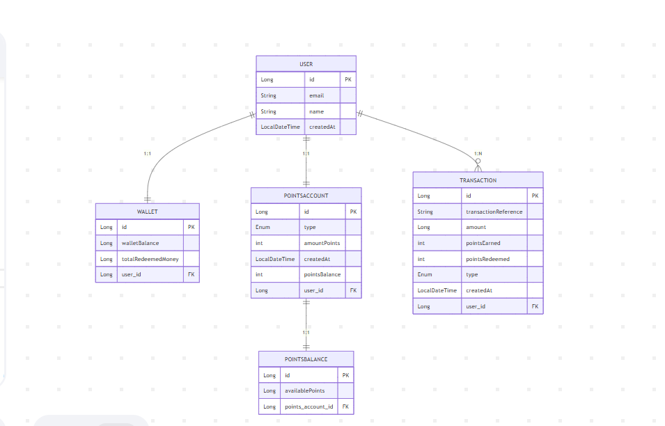
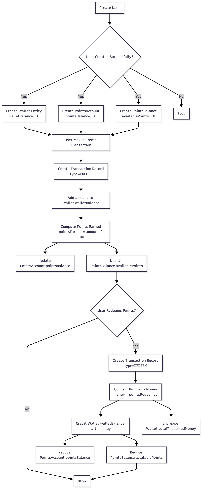

#  Ridima Points 

This is the backend  that allows users to earn and redeem
points. This system assign points to users based on the CREDIT transactions made to their wallet and  allow them to redeeem points for money to be credited to their wallet.

---

##  Tech Stack
- **Java 21**
- **Spring Boot 3**
- **Kafka**
- **Redis**
- **PostgreSQL** 
- **Zookeeper**
- **Maven** (build tool)
- **Docker & Docker Compose** (containerization & orchestration)
- **Flyway** (Db migrations)
- **Postman** ( for API testing)

---

##  Features
- User, Wallet, Points Account Creation
- Transaction, Wallet,Points Account management
- Points Awarding and Points Redemption.
- Docker support for easy setup

---
##  System Workflow



## 🛠 Getting Started

### 1. Clone the repository
```bash
git clone https://github.com/Rhonajoy/organic-certification-backend.git
cd organic-certification-backend

### 2. Local Setup
Create a .env file in the project root
Ensure the following services are running locally:
PostgreSQL
Redis
Kafka + Zookeeper
Create the database if it doesn’t exist:

### 3.Build and Run the App
```bash
  mvn clean package -DskipTests
  mvn spring-boot:run
```
The app will be available at http://localhost:8080
##  Run with Docker
### 1.Build and Run the App
```bash
   docker compose up --build -d
```
### 2.Verify Services
```bash
   docker compose ps
```
### 3.Test the Application
Access the API endpoints using Postman or browser:
GET http://localhost:8080/api/v1

##  API Documentation
http://localhost:8080/swagger-ui.html

##  API Metrics
http://localhost:8080/actuator/metrics

## License

This project is licensed under the MIT License – free to use and modify.


